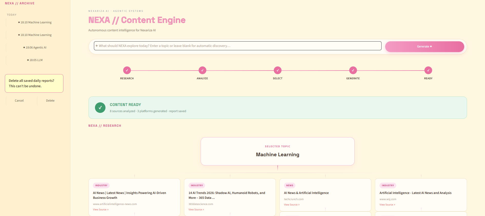

# Week 2 — Daily Content Posting Agent

**NEXA // Content Engine** — an autonomous agent that researches trending AI/tech topics and generates branded, platform-specific content for LinkedIn, Instagram, and X/Twitter, with a live visual workspace showing the agent's research and generation process.

## Features
- Auto-discovers trending AI/tech topics via Tavily search, or accepts a manual topic
- Generates platform-specific content: LinkedIn post, Instagram caption + hashtags, X/Twitter thread — all branded to Nexariza AI
- Every run saved as a structured JSON daily report
- Intelligence Canvas: shows the selected topic connected to the real sources the agent found (title, domain, category, live link) — no fabricated data
- 5-stage live workflow rail: Research → Analyze → Select → Generate → Ready
- Editable and regeneratable content cards per platform
- Daily report archive in the sidebar, grouped by date, with clear-history support
- Custom pastel dashboard UI, built from scratch

# Week 2 — Daily Content Posting Agent

**NEXA // Content Engine** — an autonomous agent that researches trending AI/tech topics and generates branded, platform-specific content for LinkedIn, Instagram, and X/Twitter, with a live visual workspace showing the agent's research and generation process.

## What was required (per the internship roadmap)
- Accept a topic, or auto-discover a trending AI/tech topic
- Generate platform-specific content for LinkedIn, Instagram, and Twitter/X
- Include Nexariza AI branding in every post
- Output structured JSON with all posts
- Simple CLI or Streamlit UI

All of the above is implemented in `daily_posting_agent.py` (core logic) and `app.py` (UI).

## What I added beyond the requirement
- **A full custom dashboard UI** ("NEXA // Content Engine"), not just a basic form — built with a distinct visual identity, pastel branded theme, and micro-interactions (hover states, glow effects, animated transitions)
- **A live 5-stage workflow rail** (Research → Analyze → Select → Generate → Ready) that visually animates as the agent actually works, instead of a plain loading spinner
- **An "Intelligence Canvas"**: the selected topic is shown connected to the real sources the agent found, with each source's title, domain, category, and a live link — so the research is transparent and verifiable, not a black box
- **Editable content cards**: each platform's output can be edited in place and saved
- **Regenerate per platform**: re-run just LinkedIn, just Instagram, or just the Twitter thread without regenerating everything
- **Persistent daily report archive** in the sidebar, grouped by date (Today/Yesterday/etc.), with a confirm-before-delete "Clear History" option
- **Topic repeat avoidance**: the agent remembers recently used topics and avoids picking the same one twice in a row
- Deliberately avoided fabricated metrics (e.g. fake "trend scores" or "brand alignment %") — every number and label shown is backed by real data the agent actually produced

## Files
- app.py — Streamlit dashboard (main deliverable to run)
- daily_posting_agent.py — core agent pipeline (research, generation, saving); also runnable standalone from the terminal
- requirements.txt — Python dependencies

## Setup

1. Create a virtual environment and activate it:

python -m venv venv
venv\Scripts\activate

2. Install dependencies:

pip install -r requirements.txt

3. Create a .env file in this folder with your API keys:

GROQ_API_KEY=your_key_here
TAVILY_API_KEY=your_key_here

Free keys available at console.groq.com and tavily.com.

4. Run the dashboard:

streamlit run app.py

Or run the plain terminal version:

python daily_posting_agent.py

## Screenshot

