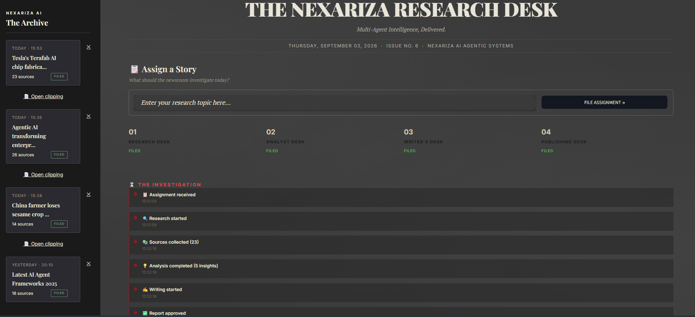
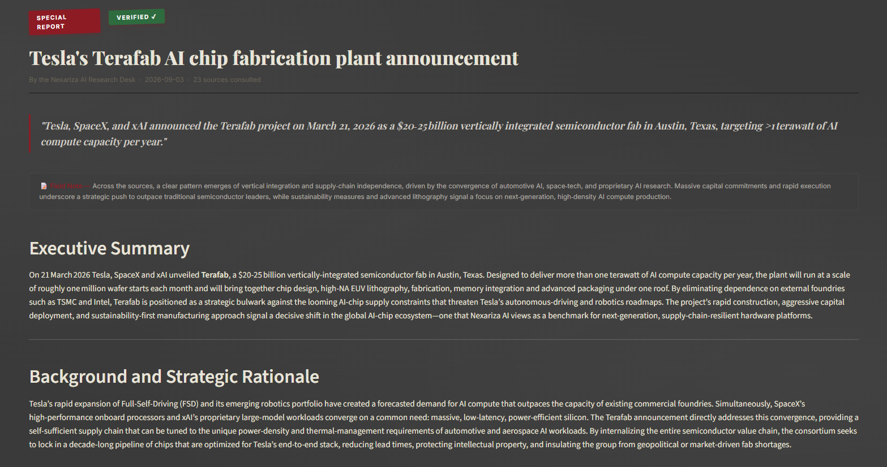
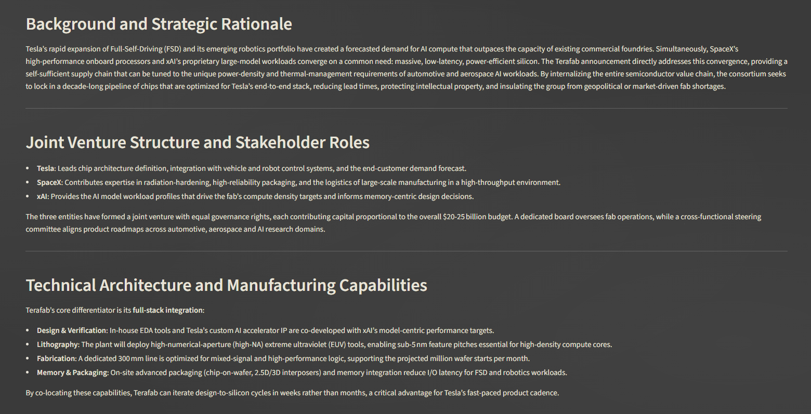
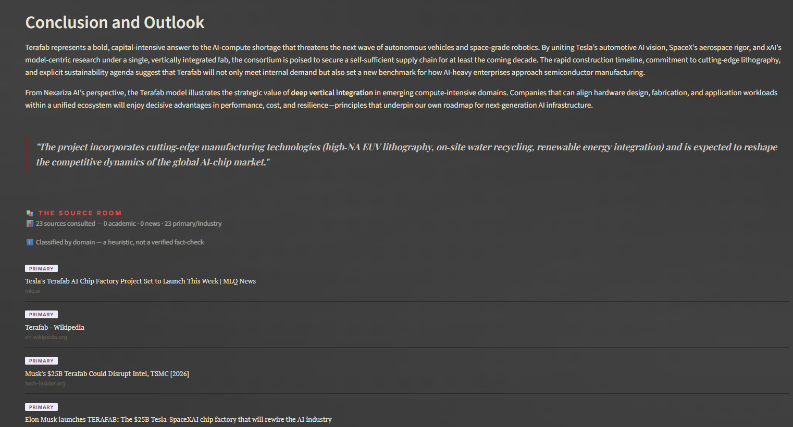
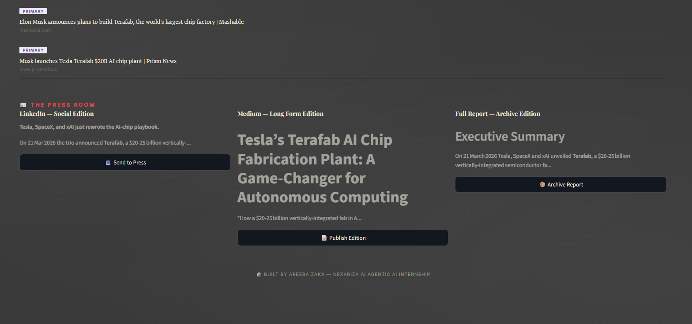

# Week 4 - Multi-Agent Research System

The Nexariza Research Desk - a 4-agent pipeline (Researcher, Analyst, Writer, Publisher) that investigates a topic and produces a full research report, styled as a live investigative newsroom.

## What was required (per the internship roadmap)
- Multi-agent pipeline: Researcher (searches and collects info), Analyst (extracts key insights), Writer (produces a professional report/blog post), Publisher (formats for LinkedIn/Medium)
- Generate a real example report on "Latest AI Agent Frameworks 2025"
- Full multi-agent codebase, GitHub, and LinkedIn post with the actual generated report

Note on tech stack: the roadmap allows CrewAI or LangGraph. I attempted CrewAI first, but it required an old numpy build that failed to compile on this machine (no C++ build tools installed). I switched to LangGraph/LangChain instead, which I'd already used successfully in Weeks 1-3, avoiding a fragile new dependency chain.

## What I added beyond the requirement
- An "Investigative Newsroom" UI: each agent is shown as a real newsroom desk (Research Desk, Analyst Desk, Writer's Desk, Publishing Desk) with live status and real stats (source count, insights identified, words drafted) as the pipeline actually runs
- Deduplicated, multi-angle web research (4 separate search queries merged into one unique source list, not just one search call)
- An accuracy safeguard in the Writer and Publisher prompts: the LLM is explicitly instructed not to invent statistics or benchmark numbers that aren't backed by the actual research
- Auto-discovery of a fresh research topic when no topic is given, with repeat-avoidance so it does not suggest the same topic twice in a row
- A full generated article layout: headline, byline, pull quotes, an editorial "Field Note," and numbered references
- The Source Room: sources classified by domain into Academic / News / Primary, clearly labeled as a heuristic, not a verified fact-check
- The Investigation: a real timestamped timeline of each pipeline stage as it actually happened
- The Press Room: downloadable LinkedIn and Medium editions plus the full report archive
- The Archive: a sidebar of past reports with delete support

## Files
- app.py - Streamlit newsroom UI (main deliverable to run)
- research_engine.py - the 4-agent pipeline (Researcher, Analyst, Writer, Publisher); also runnable standalone from the terminal
- requirements.txt - Python dependencies

## Setup

1. Create a virtual environment and activate it:

python -m venv venv
venv\Scripts\activate

2. Install dependencies:

pip install -r requirements.txt

3. Create a .env file in this folder with your API keys:

GROQ_API_KEY=your_key_here
TAVILY_API_KEY=your_key_here

Free keys available at console.groq.com and tavily.com.

4. Run the newsroom UI:

streamlit run app.py

Or run the plain terminal version, which generates the example report directly:

python research_engine.py

## Screenshots

