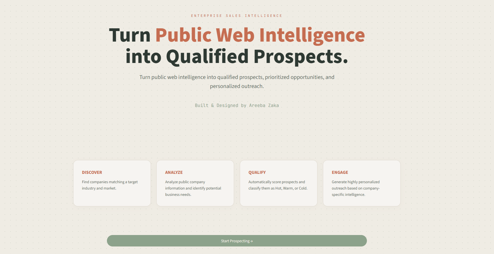
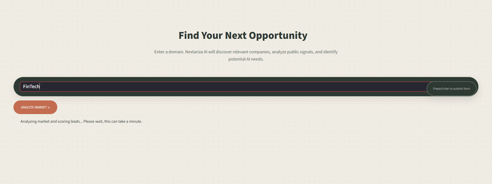
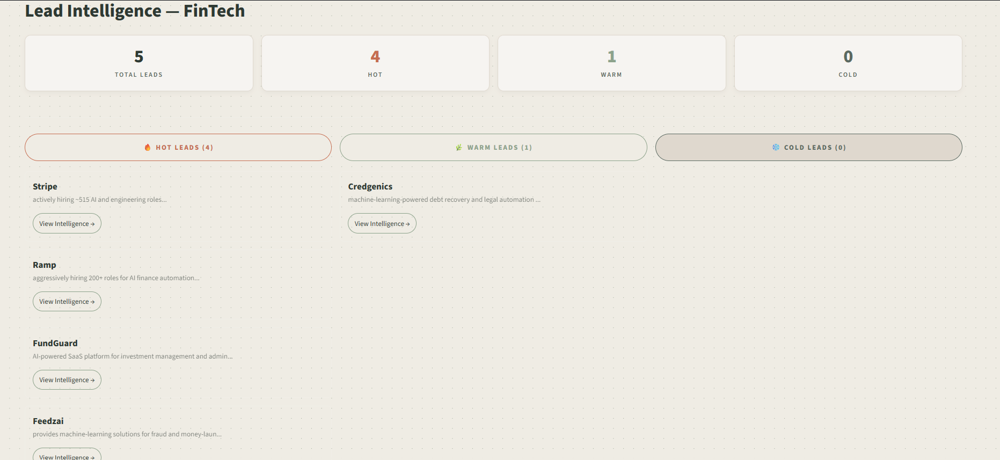
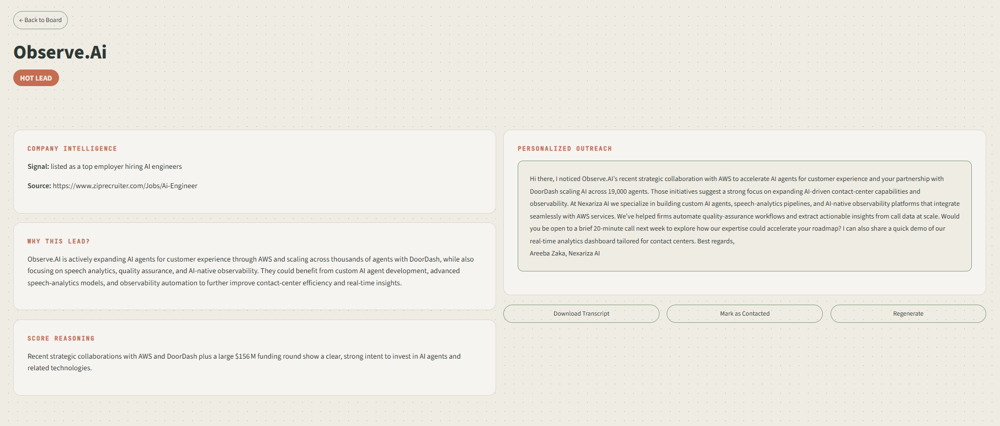
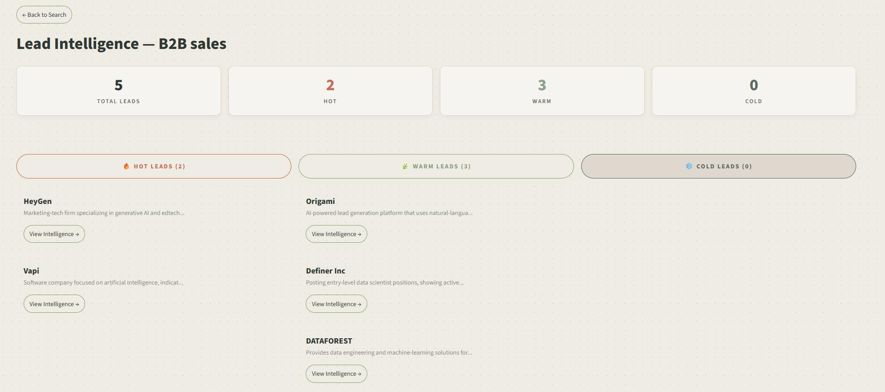
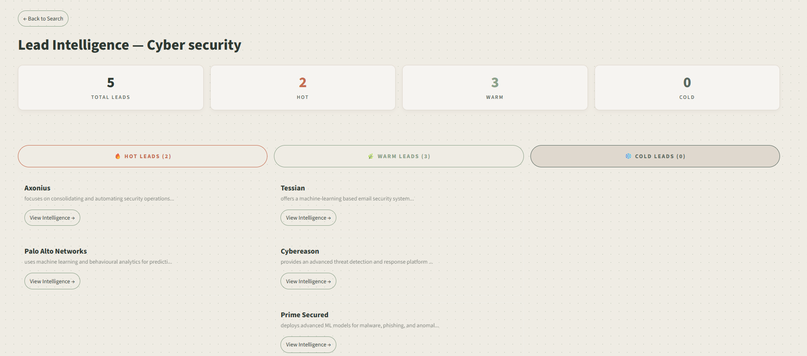
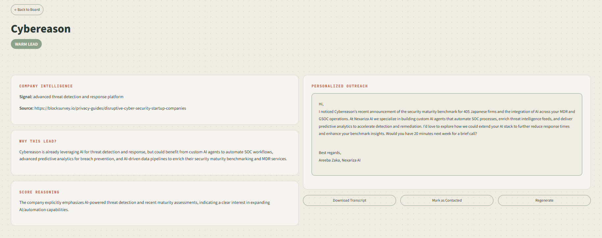

# Week 5 - Automated Lead Qualification Agent

Nexariza Lead Intelligence - an agent that discovers real companies in a target industry, researches their public AI-readiness signals, scores each as Hot/Warm/Cold, and drafts personalized outreach.

## What was required (per the internship roadmap)
- Accept a target industry (e.g., e-commerce, healthcare)
- Search for potential clients needing AI solutions
- Analyze each company's needs based on public info
- Score leads Hot/Warm/Cold
- Draft personalized outreach messages for each lead
- CLI interface, sample output of 10 qualified leads

All of the above is implemented in `lead_agent.py`, which is fully runnable as a standalone CLI tool, and `app.py`, which wraps it in a visual market analysis interface.

**Note on approach:** the roadmap mentions searching LinkedIn directly. Scraping LinkedIn violates their Terms of Service and requires fragile, unreliable infrastructure. Instead, this agent searches the public web (news, job postings, funding announcements, product launches) for real, named companies showing genuine AI-buying signals - the same legitimate approach real B2B sales-intelligence tools use. Every company in the output is real and found in live search results, not a fabricated example.

**Note on tech stack:** the roadmap allows AutoGen. I used LangChain/Groq instead, consistent with every previous week, for the same reasons - free, reliable, no fragile dependency installs, already proven working in this environment.

## What I added beyond the requirement
- Real company discovery grounded strictly in live web search results - the LLM is explicitly instructed to never invent company names
- A second, targeted research pass per company for deeper public context before scoring
- Outreach messages grounded in the specific real signal found for that company, not generic templated flattery
- A market-analysis style UI: enter an industry, discover and score leads visually, expand any lead into a full personalized outreach card
- Per-lead actions: download the outreach transcript, mark as contacted, or regenerate the draft
- Consistent, placeholder-free message formatting (no `[Name]` or `[Your Name]` artifacts)
- Signed and attributed outreach: every message is signed as Areeba Zaka, Nexariza AI

## Files
- `lead_agent.py` - the core CLI agent (discovery, research, scoring, outreach); this is the required CLI deliverable
- `app.py` - Streamlit UI wrapping the same pipeline
- `requirements.txt` - Python dependencies

## Setup

1. Create a virtual environment and activate it:

python -m venv venv
venv\Scripts\activate

2. Install dependencies:

pip install -r requirements.txt

3. Create a `.env` file in this folder with your API keys:

GROQ_API_KEY=your_key_here
TAVILY_API_KEY=your_key_here

Free keys available at console.groq.com and tavily.com.

4. Run the CLI version:

python lead_agent.py

5. Or run the UI:

streamlit run app.py

## Screenshots

