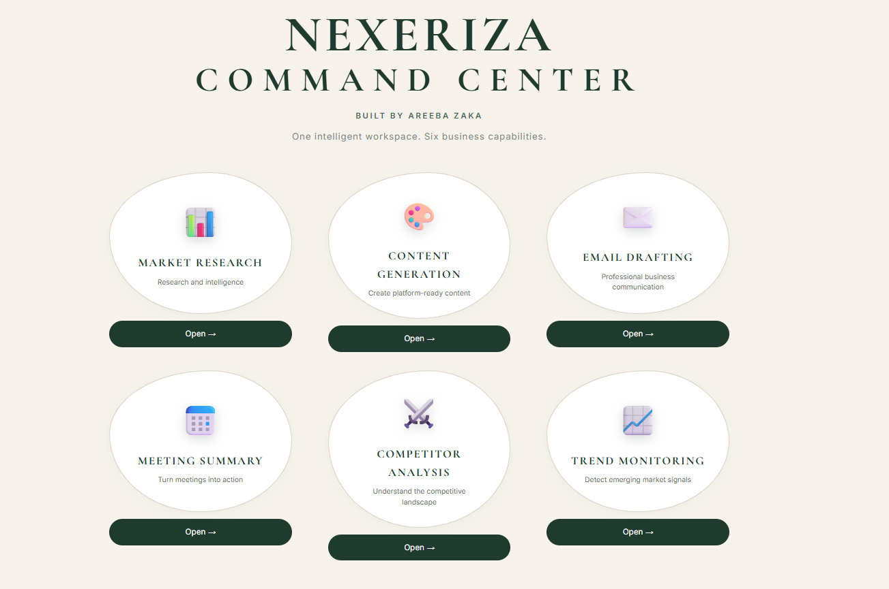
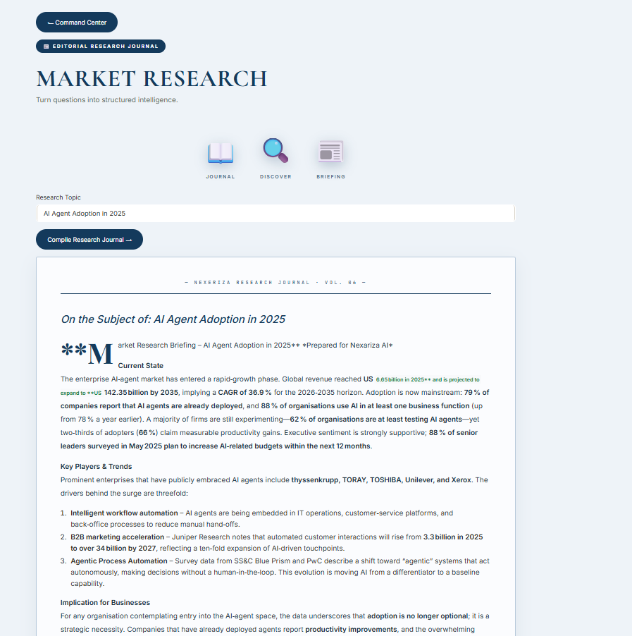
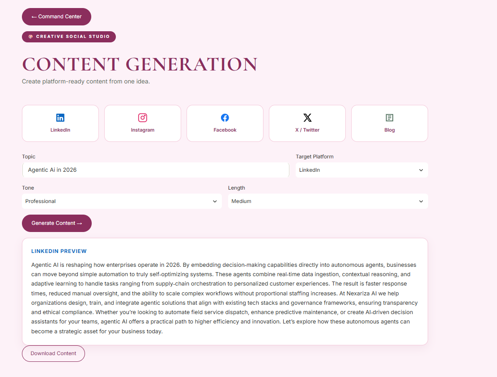
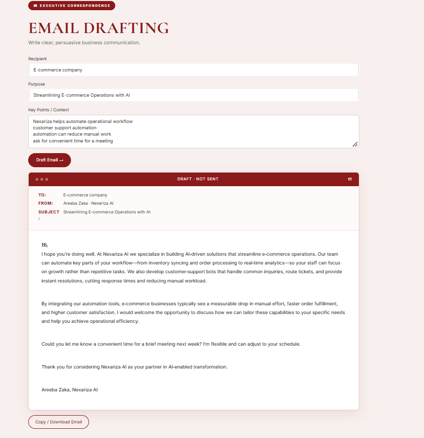
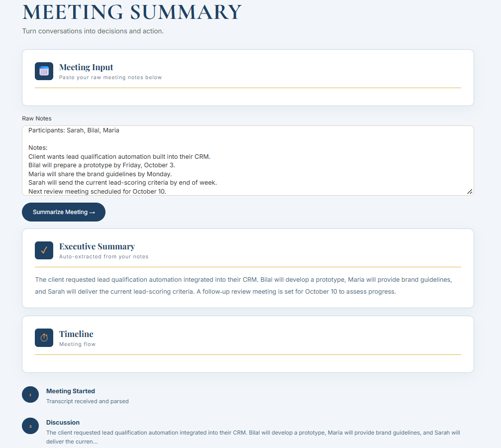
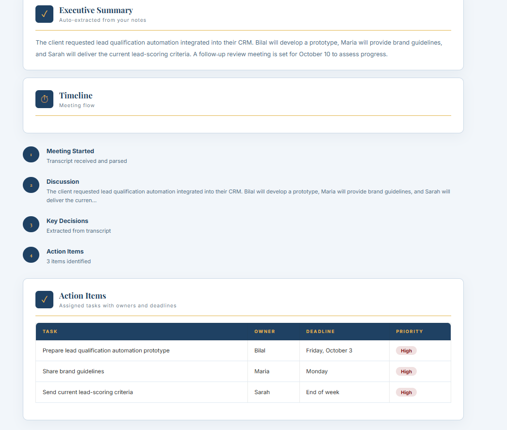
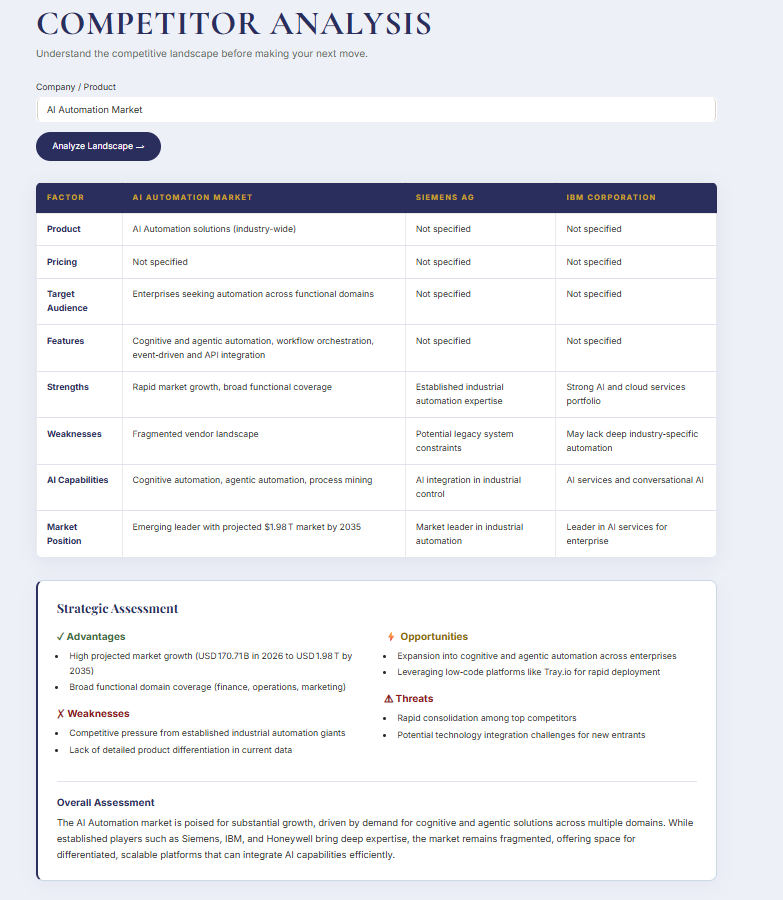
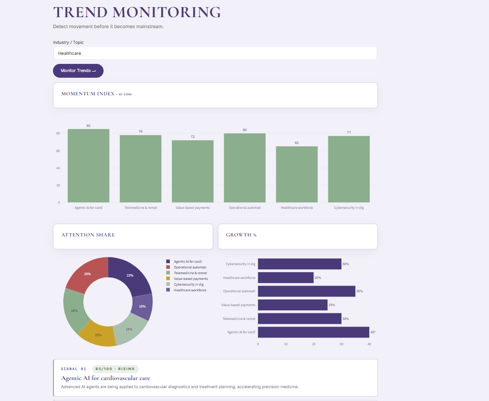

# Week 6 - Nexariza Command Center (Capstone)

An all-in-one AI business command center that unifies six specialized tools — Market Research, Content Generation, Email Drafting, Meeting Summary, Competitor Analysis, and Trend Monitoring — into a single premium workspace.

Each tool lives in its own dedicated environment with its own color palette, typography, and layout, while staying inside one cohesive Nexariza design language.

## What was required (per the internship roadmap)

- Build a comprehensive AI assistant for Nexariza
- Include six tools: Market Research, Content Generation, Email Drafting, Meeting Summary, Competitor Analysis, Trend Monitoring
- Deliver a production-ready codebase
- Deploy to Streamlit Cloud / Hugging Face Spaces
- Comprehensive README + LinkedIn case study

All of the above is implemented across `backend.py` (all six AI tools) and `app.py` (the Command Center frontend).

**Note on tech stack:** the roadmap mentions AutoGen. I used LangChain / Groq instead, consistent with every previous week, for the same reasons — free, fast, reliable, and already proven working in this environment.

**Note on backend preservation:** All AI logic (prompts, API calls, JSON parsing, error handling) is separated cleanly into `backend.py`. The frontend routes between tools using Streamlit session state and never modifies backend behaviour — it only calls into it.

## What I built beyond the requirement

- **Six distinct tool environments** — each tool has its own visual identity (blue journal, pink creative studio, red executive correspondence, blue calendar, indigo war room, sage/lilac observatory) while preserving one shared design language
- **Click-to-open gates** on the landing page — no more generic card grid; each tool is an oval, tactile entry point
- **Market Research as an editorial journal** — with a drop-cap opening paragraph, "NEXERIZA RESEARCH JOURNAL · VOL. 06" masthead, and 3D-style journal/discover/briefing icons
- **Content Generation as a social media studio** — real SVG brand icons for LinkedIn, Instagram, Facebook, X, and Blog; each platform gets its own styled preview card
- **Email Drafting as a real email window** — TO / FROM / SUBJECT metadata header, toolbar with dot controls, and a serif body styled like a real correspondence
- **Meeting Summary as a calendar workspace** — structured timeline with numbered markers and a **real HTML table** for action items, with priority pills (High = red, Medium = gold, Low = green)
- **Competitor Analysis as a strategic war table** — 4-column HTML comparison table (Factor | Company | Comp 1 | Comp 2) with a strategic assessment panel for advantages / weaknesses / opportunities / threats
- **Trend Monitoring with real Plotly charts** — horizontal momentum bar chart, donut chart of attention share, and a horizontal growth % bar chart, all built from real values returned by the LLM
- **Recent Activity log** — every tool run is logged with a clickable "reopen" button and a delete button; persisted to `activity_log.json`
- **Distinct per-page theme injection** — background color and accent color change dynamically as you move between tools, injected on the root `.stApp` element so there's no blank space at the top of any page
- **← Command Center navigation** — every tool page has a top-left return button; no sidebar, no VS Code restart needed

## Files

- `backend.py` — all six AI tools (market_research, generate_content, draft_email, summarize_meeting, competitor_analysis, monitor_trends) plus the shared activity log
- `app.py` — the Streamlit Command Center frontend (routing, themes, UI)
- `requirements.txt` — Python dependencies
- `.streamlit/config.toml` — Streamlit theme configuration (light mode, forest green accents)

## Setup

1. Create a virtual environment and activate it:

python -m venv venv
venv\Scripts\activate

2. Install dependencies:

pip install -r requirements.txt

3. Create a `.env` file in this folder with your API keys:

GROQ_API_KEY=your_key_here
TAVILY_API_KEY=your_key_here

Free keys available at console.groq.com and tavily.com.

4. Create a `.streamlit` folder in this directory containing `config.toml`:

[theme]
base="light"
primaryColor="#1F3A2E"
backgroundColor="#F7F3EC"
secondaryBackgroundColor="#FFFFFF"
textColor="#2B2E2B"

5. Run the Command Center:

streamlit run app.py

## Screenshots

## Screenshots

**Built by Areeba Zaka** · Nexariza AI · Agentic AI Internship — Week 6 Capstone